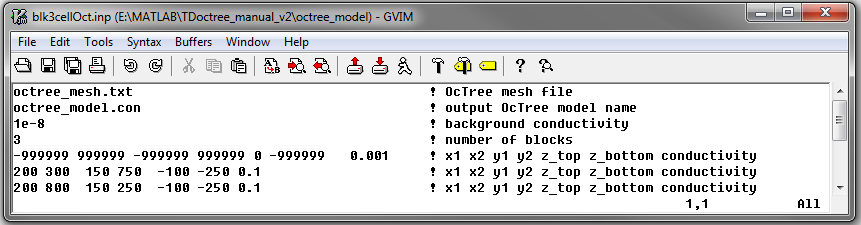
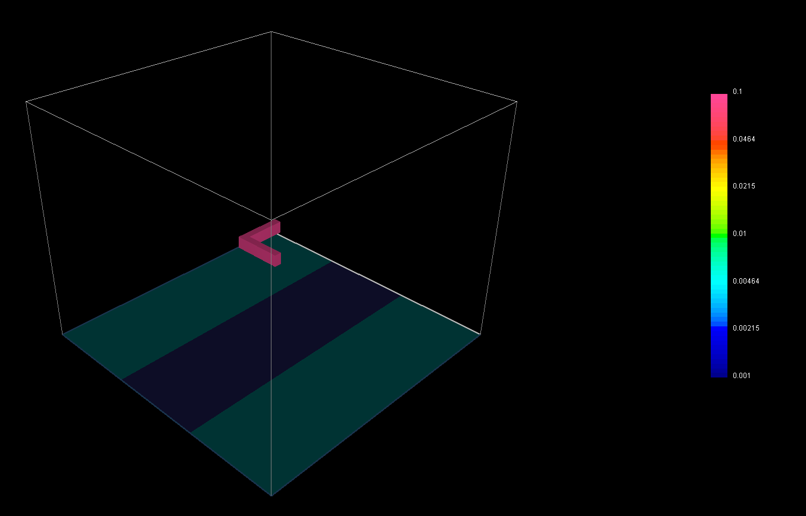

.. _example_model:

Create Model
============

Here, the code **blk3cellOct.exe** and the input file **blk3cellOct.inp** (:ref:`see format <tdoctree_input_model>`) are used to create a conductivity model on the OcTree mesh. For this example, we use the mesh that was created in the example ":ref:`create OcTree mesh<example_octree>`". Files relevant to this part of the example are in the sub-folder *octree_model*. Before running this example, you may want to do the following:

	- `Download and open the zip folder containing the entire td octree v2 example <https://github.com/ubcgif/tdoctree/raw/tdoctree_v2/assets/tdoctree_v2_example.zip>`__ (if not done already)
	- Learn how to run :ref:`blk3cellOct<tdoctree_model>` from command line
	- Learn the format of the input files :ref:`blk3cellOct.inp<tdoctree_input_model>`

Here is the input file for **blk3cellOct.exe**

The resulting Octree model shows a conductive block (:math:`\sigma` = 0.1 S/m) within a more resistive background (:math:`\sigma_b` = 0.001 S/m).

