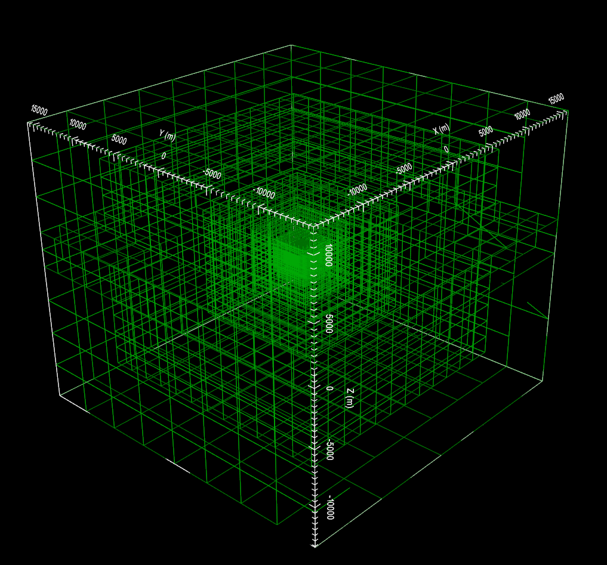

.. _example_octree:

Create OcTree Mesh
==================

Here, the code **create_octree_mesh_td_v2.exe** and the input file **octree_mesh.inp** (:ref:`see format <tdoctree_input_octree>`) are used to create an OcTree mesh based on the set of observation locations. Files relevant to this part of the example are in the sub-folder *octree_mesh*. Before running this example, you may want to do the following:

	- `Download and open the zip folder containing the entire tdoctree v2 example <https://github.com/ubcgif/tdoctree/raw/tdoctree_v2/assets/tdoctree_v2_example.zip>`__ (if not done already)
	- :ref:`Learn how to run code from command line <tdoctreeoctree>`
	- :ref:`Learn the format of the input file <tdoctree_input_octree>`

To generate the OcTree mesh, the following input file was used:

.. figure:: ../inputfiles/images/octree_input.png
     :align: center
     :width: 700

To keep the problem simple, the topography is set to a constant elevation of 0 m. The resulting OcTree mesh is shown below:

