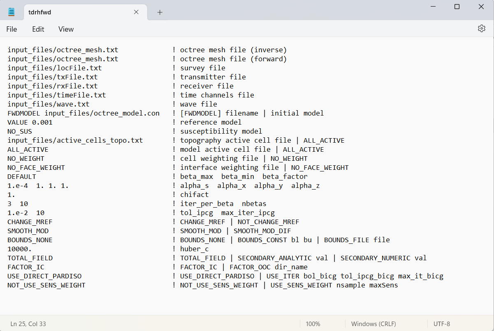
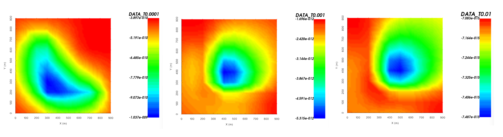

.. _example_fwd:

Forward Modeling
================

Here, the code **tdoctree_v2.exe** and the input file **tdoctreefwd.inp** (:ref:`see format <tdoctree_input_fwd>`) are used to forward model TEM data for a synthetic airborne survey. We are interested in the vertical dB/dt response. Files relevant to this part of the example are in the sub-folder *fwd*. For this example, we use the model that was created in the example ":ref:`create model<example_model>`". Before running this example, you may want to do the following:

	- `Download and open the zip folder containing the entire tdoctree v2 example <https://github.com/ubcgif/tdoctree/raw/tdoctree_v2/assets/tdoctree_v2_example.zip>`__ (if not done already)
	- :ref:`Learn how to run code from command line <tdoctree_fwd>`
	- :ref:`Learn the format of the input file <tdoctree_input_fwd>`

To forward model the data, the following input file was used:

Our survey was designed to measure dBz/dt. Below, we show dBz/dt at 0.0001 s, 0.001 s and 0.01 due to step-off excitation.

