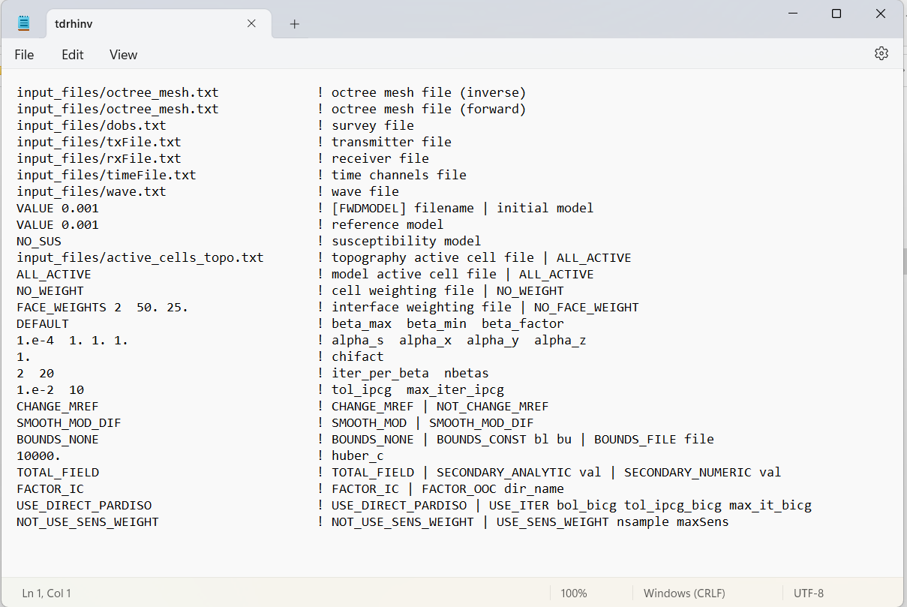
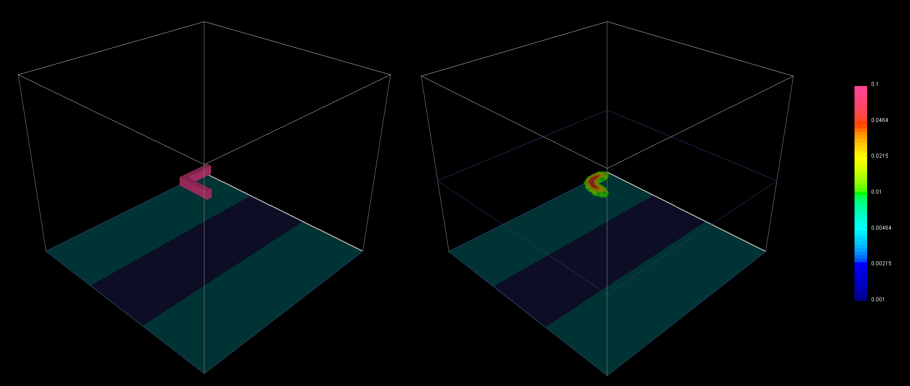

.. _example_inv:

Inversion
=========

Here, the code **tdoctree_v2.exe** and the input file **tdoctreeinv.inp** (:ref:`see format <tdoctree_input_inv>`) are used to invert dBz/dt data. TEM data were created in the example ":ref:`forward modeling<example_fwd>`". Gaussian noise was added to the synthetic data. The noise had a standard deviation of 1e-14 T/s +/- 5\%. Files relevant to this part of the example are in the sub-folder *inv*. Before running this example, you may want to do the following:

	- `Download and open the zip folder containing the entire tdoctree v2 example <https://github.com/ubcgif/tdoctree/raw/tdoctree_v2/assets/tdoctree_v2_example.zip>`__ (if not done already)
	- :ref:`Learn how to run code from command line <tdoctree_inv>`
	- :ref:`Learn the format of the input file <tdoctree_input_inv>`

To invert the synthetic data, the input file below was used:

The true model (left) and the final recovered model (right) are shown below. A cutoff of 0.01 S/m has been used for both models. The recovered model has been slices horizontally at an elevation of -175 m to show the maximum recovered conductivity.

