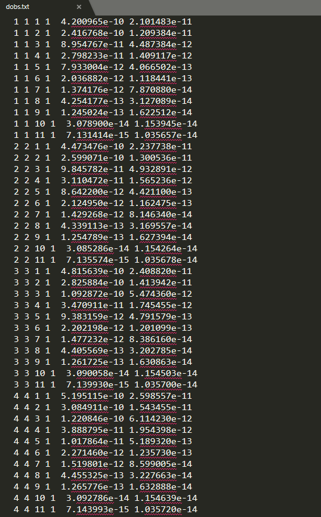

.. _obsFile:

Observations File
=================

This file is input when forward modeling or inverting field-collected data. Using 6 columns, the observation file indexes transmitters, receivers and times used for each measurement as well as the field observations and data uncertainties. Each row defines a unique field measurement. The general format is as follows:

.. note::
    - Blue hyperlinked entries are values specified by the user
    - To omit a particular datum in the inversion, used the flag **-99** on its corresponding uncertainty.

| :ref:`tx_ind<tdoctree_obs_ln1>` :math:`\;` :ref:`rx_ind<tdoctree_obs_ln2>` :math:`\;` :ref:`t_ind<tdoctree_obs_ln3>` :math:`\;` :ref:`data_opt<tdoctree_obs_ln4>` :math:`\;` :ref:`data<tdoctree_obs_ln5>` :math:`\;` :ref:`uncertainty<tdoctree_obs_ln6>`
| :ref:`tx_ind<tdoctree_obs_ln1>` :math:`\;` :ref:`rx_ind<tdoctree_obs_ln2>` :math:`\;` :ref:`t_ind<tdoctree_obs_ln3>` :math:`\;` :ref:`data_opt<tdoctree_obs_ln4>` :math:`\;` :ref:`data<tdoctree_obs_ln5>` :math:`\;` :ref:`uncertainty<tdoctree_obs_ln6>`
| :ref:`tx_ind<tdoctree_obs_ln1>` :math:`\;` :ref:`rx_ind<tdoctree_obs_ln2>` :math:`\;` :ref:`t_ind<tdoctree_obs_ln3>` :math:`\;` :ref:`data_opt<tdoctree_obs_ln4>` :math:`\;` :ref:`data<tdoctree_obs_ln5>` :math:`\;` :ref:`uncertainty<tdoctree_obs_ln6>`
| :math:`\;\;\;\;\;\;\;\;\;\;\;\;\;\;\;\;\;\;\;\;\;\;\;\;\;\;\;\;\;\;\;\;\;\; \vdots`
| :ref:`tx_ind<tdoctree_obs_ln1>` :math:`\;` :ref:`rx_ind<tdoctree_obs_ln2>` :math:`\;` :ref:`t_ind<tdoctree_obs_ln3>` :math:`\;` :ref:`data_opt<tdoctree_obs_ln4>` :math:`\;` :ref:`data<tdoctree_obs_ln5>` :math:`\;` :ref:`uncertainty<tdoctree_obs_ln6>`
|
|
|

Click here to `see an example file <https://github.com/ubcgif/tdoctree/raw/tdoctree_v2/assets/supporting_files/dobs.txt>`__ for an airborne TEM survey.

.. important:: Due to the way the forward problem is solved, it is imperative that the user sort the observations:

    - First by transmitter
    - Then by receiver
    - Then by time channel

Below is an example of an observations file.

**Parameter Descriptions**

.. _tdoctree_obs_ln1:

    - **tx_ind:** The index corresponding to the desired transmitter within the :ref:`transmitter file<receiverFile>`. 

.. _tdoctree_obs_ln2:

    - **rx_ind:** The index corresponding to the desired receiver within the :ref:`receiver file<receiverFile>`.

.. _tdoctree_obs_ln3:

    - **t_ind:** The index corresponding to the desired time channel within the :ref:`time channels file<timeFile>`.

.. _tdoctree_obs_ln4:

    - **data_opt:**

        - A flag value of *2* is entered if the datum is the magnetic field *H* in units A/m
        - A flag value of *1* is entered if the datum is the time-derivative *dB/dt* in units T/s

.. _tdoctree_obs_ln5:

    - **data:** The data observation (H or dB/dt).

.. _tdoctree_obs_ln6:

    - **uncertainty:** The uncertainty for the datum.

