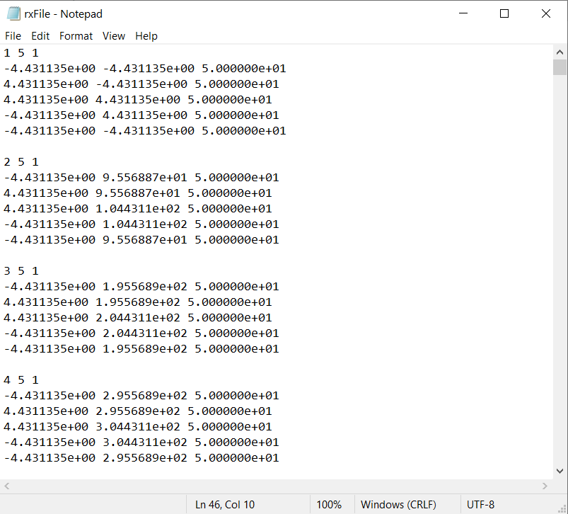

.. _receiverFile:

Transmitter and Receiver Files
==============================

The exact dimensions of the transmitters or receivers used to model TEM data are defined within a transmitter or a receiver file, respectively; i.e. transmitters are defined within a transmitter file and receivers are defined within a receivers file. Because transmitters and receivers are both defined as wire segments, the format of the transmitter and receiver files is identical.

.. note::
    - Bolded entries are fixed flags recognized by the Fortran codes and blue hyperlinked entries are values/regular expressions specified by the user

Format
------

The lines of a transmitter/receiver file are formatted as follows:

|
| :ref:`ID<tdrh_rec_ln1>` :math:`\;` :ref:`N<tdrh_rec_ln2>` :math:`\;` :ref:`1<tdrh_rec_ln3>`
| :math:`\;\;\; x_1 \; y_1 \; z_1`
| :math:`\;\;\;\;\;\;\;\; \vdots`
| :math:`\;\; x_N \; y_N \; z_N`
| :ref:`ID<tdrh_rec_ln1>` :math:`\;` :ref:`N<tdrh_rec_ln2>` :math:`\;` :ref:`1<tdrh_rec_ln3>`
| :math:`\;\;\; x_1 \; y_1 \; z_1`
| :math:`\;\;\;\;\;\;\;\; \vdots`
| :math:`\;\; x_N \; y_N \; z_N`
| :ref:`ID<tdrh_rec_ln1>` :math:`\;` :ref:`N<tdrh_rec_ln2>` :math:`\;` :ref:`1<tdrh_rec_ln3>`
| :math:`\;\;\; x_1 \; y_1 \; z_1`
| :math:`\;\;\;\;\;\;\;\; \vdots`
| :math:`\;\; x_N \; y_N \; z_N`
|
|

Below is an example of a transmitters or receivers file where the respective items are closed horizontal loops.

Parameter Descriptions
----------------------

.. _tdrh_rec_ln1:

    - **ID:** A unique index number for the transmitter or receiver. The index numbers should be increasing.

.. _tdrh_rec_ln2:

    - **N:** The number of points defining the transmitter/receiver.

.. _tdrh_rec_ln3:

    - **1:** As of May 2018, a flag value of 1 is entered here. In future iterations of the code, this entry may be related to additional functionality.
        
.. _tdrh_rec_ln4:

    - :math:`\mathbf{x_i \;\; y_i \;\; z_i}`: Denotes the X (Easting), Y (Northing) and Z (elevation) locations for nodes defining transmitter/receiver.

Inductive and Galvanic Sources
------------------------------

**Transmitter Loop (inductive source):** When defining inductive sources, you **must** close the loop; i.e. the location of the fist and last nodes defining the wire path must be identical. Thus for a loop comprised of N segments, the user must define the source using N+1 nodes. The wire path of the transmitter loop is defined according to the right-hand rule (counter-clockwise); think about the Biot-Savart law and how we used our right hand to define the direction of the currents and the direction of the magnetic field they produce.

Below, we define the 183rd source in a survey using 5 nodes. The source is horizontal square 4m by 4m loop that lies 10 m above the Earth's surface. According to the right-hand rule (counter-clockwise), the primary magnetic field produced by this source is upward (+ve Hz) at the centre of the loop during the on-time::

    183 5 1
    -2.0 -2.0 10.0
    2.0 -2.0 10.0
    2.0 2.0 10.0
    -2.0 2.0 10.0
    -2.0 -2.0 10.0

**Current Wire (Galvanic Source):** When defining galvanic sources, the locations of the first and last nodes are different; i.e. the wire path **is not** closed. Positive current flows along the connected set of straight wire segments from the first node to the last node. For a wire path comprised of N segments, the user must also define the source using N+1 nodes.

Below, we define the 28th source in a survey using 3 nodes (2 segments). The source is a 200 m long electric dipole source on the Earth's surface.
According to the right-hand rule, the primary magnetic field on the surface should be upward (+ve Hz) to the North of the source during the on-time::

    28 3 1
    -100.0 0.0 0.0
    0.0 0.0 0.0
    100.0 0.0 0.0

Measuring Magnetic and Electric Fields
--------------------------------------

**Loop Receiver (H or dB/dt):** Closed loops are used to define receivers that measure directional components of the magnetic field or its time-derivative; i.e. the location of the fist and last nodes defining the wire path must be identical. The flag for setting loop receivers to measure H or dB/dt is described in the :ref:`observations file <obsFile>` page. H-field measurements are in units A/m. And dB/dt measurements are in units T/s.

The code computes magnetic field data by integrating the electric field over the path of the loop receiver to obtain the EMF, then converting the EMF to an H or dB/dt measurement. When defining H or dB/dt receivers within the file, the nodes defining the receiver loop are ordered in the counter-clockwise (right-handed) manner. This was done to keep consistency with how we define transmitter loops; i.e. the relationship between wire path and field direction. The direction of integration of the electric field over the path of the wire for receivers is therefore handled internally.

Here, we define the 8th receiver loop in a survey. It is a square 4m by 4m loop that can be used to measure the component of the magnetic field, or its time-derivative, in the Easting direction (i.e. Hx or dBx/dt)::

    8 5 1
    0.0 -0.5 -0.5
    0.0 0.5 -0.5
    0.0 0.5 0.5
    0.0 -0.5 0.5
    0.0 -0.5 -0.5

**Wire Receiver (electric field):** If the first and last nodes defining the wire path are not in the same place, the user will define a grounded receiver which measures the electric field in units V/m. The grounded loop can be more than one segment long. The *TDRH v2 tiled* package does not model the electric field at a point. Instead, it intergrates the electric field over the path of the wire, then averages by the length; see the :ref:`theory section <theory_data>` .

Below, we define the 65th receiver in a survey using 3 nodes (2 segments). The receiver is a 20 m long electric dipole source on the Earth's surface.
Since the wire path is defined from (-10, 0, 0) to (10, 0, 0), this receiver should provide the Easting component of the electric field (i.e. Ex)::

    65 3 1
    -10.0 0.0 0.0
    0.0 0.0 0.0
    10.0 0.0 0.0

