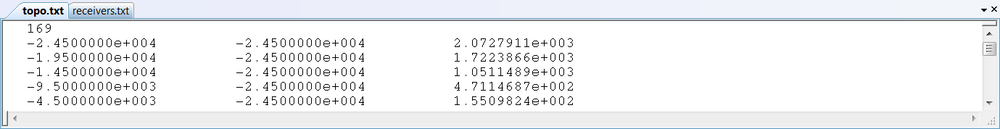

.. _topoFile:

Topography Data/Polygon File
============================

Topography and polygon files share the same format and are both used in the generation of :ref:`OcTree meshes<octreeFile>`. Whereas topography files (**topo.txt**) are used to define surface topography, polygon files (**poly.txt**) are used to define the horizontal extent of the core mesh region.

The first line in the topography/polygon file gives the number of points followed by an (x,y,z) position for each point. Note that in the case of topography, this is **not** the file that is used to define active topography in the forward modeling and inversion programs. Forward modeling and inversion executables require active cell models to define topography. 

     Example topography file

