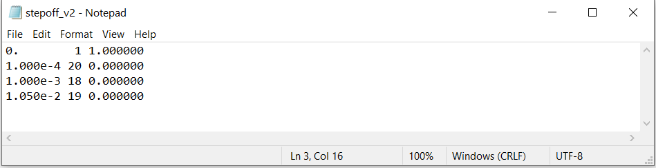
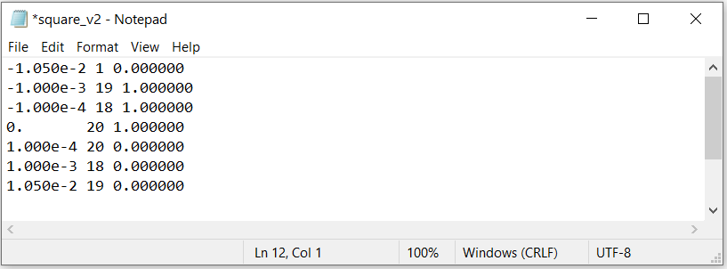

.. _waveFile:

Wave File
=========

The wave file defines the time-dependent current in the transmitter during both the on-time and off-time, as well as the time-stepping that is used to solve the time-dependent Maxwell system. Unlike past generations of tdoctree, the tdoctree_v2 code allows the user to define a different waveform for each source. However, the time-stepping is consistent regardless of the source.

.. important::

    - You want to discretize in time appropriately while keeping the number of unique step lengths as small as possible. Every different step length used will result in the code needing store the factorization of another linear system.
    - The latest time defining the transmitter waveform(s) **must** be after the latest time channel 
    - The first time defining the transmitter waveform(s) **must** be before the earliest time channel 
    - The first column in the wave file must have increasing values

Simple Format
-------------

Here, the current is defined explicitly at every time step.

Single Waveform for All Transmitters
^^^^^^^^^^^^^^^^^^^^^^^^^^^^^^^^^^^^

In this case, the same waveform is used for all transmitters. The format for the wave file is as follows:

|
|
| :math:`t_0 \;\;\; 1 \;\;\; I_0`
| :math:`t_1 \;\;\; 1 \;\;\; I_1`
| :math:`t_2 \;\;\; 1 \;\;\; I_2`
| :math:`\, \vdots \;\;\;\; \vdots \;\;\;\;\; \vdots`
| :math:`t_f \;\;\; 1 \;\;\; I_f`
|
|

where

    - :math:`t_i` is a particular time in seconds
    - :math:`1` is a specific value used for this case
    - :math:`I_i` is the current in the transmitter at time :math:`t_i`

Please be aware that you are defining the transmitter current during both the on-times and off times. The code will assume a steady-state transmitter current of :math:`I_0` for :math:`t \leq t_0` .

**Step-Off Example:**

Here, we have provided an `example file for a stepoff waveform <https://github.com/ubcgif/tdoctree/raw/tdoctree_v2/assets/wave_examples/stepoff_v2_general.txt>`__ . This wave file is designed to model data at logarithmically spaced time channels between t = 0.0001 s and t = 0.01 s. We have a least 20 steps from t = 0 s to t = 1e-4 s in order to accurately model data at the first time channel. And the final time in the wave file is after t = 0.01 s. Notice that because there are only 3 distinct time step lengths (5e-6 s, 5e-5 s and 5e-4 s), the code only needs to store the factorizations of 3 linear systems.

**Arbitrary Waveform Example:**

We have also provided an `example file for an arbitrary waveform <https://github.com/ubcgif/tdoctree/raw/tdoctree_v2/assets/wave_examples/arbitrary_v2_general.txt>`__ . The waveform is a half-sine function whose on-time is from -20 ms to 0 ms. This wave file is designed to model data at logarithmically spaced time channels between t = 0.0001 s and t = 0.01 s. In this case, we must define the waveform at t<0 s. Notice that once againg there are only 3 distinct time step lengths (5e-6 s, 5e-5 s and 5e-4 s) and the code only needs to store the factorizations of 3 linear systems.

Unique Waveform for Each Transmitter
^^^^^^^^^^^^^^^^^^^^^^^^^^^^^^^^^^^^

In this case, a separate waveform is used for each transmitters. For each transmitter in the transmitter file, the user must add a column defining the waveform current at each time. The format for the wave file is as follows:

|
|
| :math:`t_0 \;\;\; 1 \;\;\; I_0^{(1)} \;\;\; I_0^{(2)} \cdots \; I_0^{(n)}`
| :math:`t_1 \;\;\; 1 \;\;\; I_1^{(1)} \;\;\; I_1^{(2)} \cdots \; I_1^{(n)}`
| :math:`t_2 \;\;\; 1 \;\;\; I_2^{(1)} \;\;\; I_2^{(2)} \cdots \; I_2^{(n)}`
| :math:`\, \vdots \;\;\;\;\, \vdots \;\;\;\;\; \vdots \;\;\;\;\;\;\;\, \vdots \;\;\;\,\ddots\;\; \vdots`
| :math:`t_f \;\;\; 1 \;\;\; I_f^{(1)} \;\;\; I_f^{(2)} \cdots \; I_f^{(n)}`
|
|

where

    - :math:`t_i` is a particular time in seconds
    - :math:`1` is a specific value used for this case
    - :math:`I_i^{(j)}` is the current at time :math:`t_i` for transmitter :math:`j`

**Arbitrary Waveform Example:**

We have also provided an `example file for an arbitrary waveform file <https://github.com/ubcgif/tdoctree/raw/tdoctree_v2/assets/wave_examples/arbitrary_v2_multi.txt>`__ where there are 4 transmitter, each with their own waveform. Each waveform is a half-sine function whose on-time is from -20 ms to 0 ms but there is some added noise. This wave file is designed to model data at logarithmically spaced time channels between t = 0.0001 s and t = 0.01 s. In this case, we must define the waveform at t < 0 s. Notice that once againg there are only 3 distinct time step lengths (5e-6 s, 5e-5 s and 5e-4 s) and the code only needs to store the factorizations of 3 linear systems.

Compact Format
--------------

A compact format can be used to define waveform files; either a single waveform for all transmitters or a distinct waveform for each transmitter. For a single waveform used by all transmitters, the format is:

|
| :math:`t_0 \;\;\; 1 \;\;\;\, I_0`
| :math:`t_1 \;\;\; n_1 \;\;\; I_1`
| :math:`t_2 \;\;\; n_2 \;\;\; I_2`
| :math:`\;\;\;\;\;\;\, \vdots`
| :math:`t_f \;\;\; n_f \;\;\; I_f`
|
|

where

    - :math:`t_i` is a particular time in seconds
    - :math:`1` must be used as the entry for the second entry on the first line
    - :math:`n_i` is the number of linear time steps between times :math:`t_{i-1}` and :math:`t_i`
    - :math:`I_i` is the current in the transmitter at all times within interval :math:`i`; i.e. for :math:`t_{i-1} < t \leq t_i`

**Step-Off Example:**

For a unit step-off waveform, we have provided an example wave file is shown below. This waveform is IDENTICAL to the stepoff waveform shown in the *general format section* . We simply used the compact format.

     Click to `download <https://github.com/ubcgif/tdoctree/raw/tdoctree_v2/assets/wave_examples/stepoff_v2.txt>`__ . 

**Square Pulse Example:**

Here, we consider the wave file for a square pulse waveform. The on-time begins at t = -20 ms and ends at t = 0 s. This wave file is designed to model data at time channels between t = 0.0001 s and t = 0.01 s. When designing the waveform, several things were considered:

    - The waveform during the on-time was discretized to finer time-steps as we approached the off-time. This was done to more accuately model the early time data
    - We made sure to minimize the number of distinct time-step lengths used to model the data. In this case, we discretized the waveform to use step lengths of 5e-6 s, 5e-5 s and 5e-4 s. Thus, the code only needs to store the factorizations of 3 linear systems.

     Click to `download <https://github.com/ubcgif/tdoctree/raw/tdoctree_v2/assets/wave_examples/square_v2.txt>`__ .
