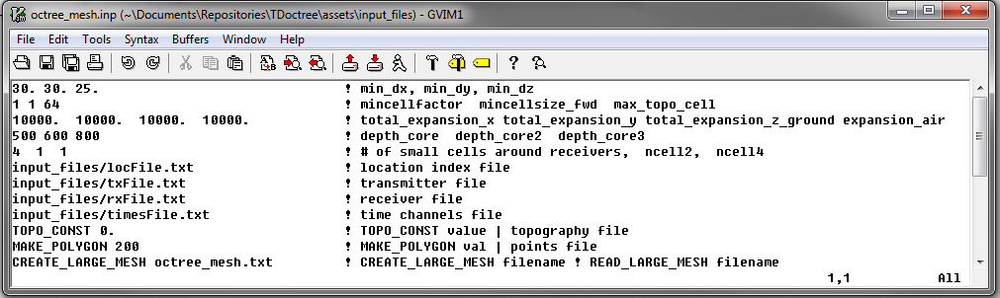

.. _tdoctree_input_octree:

Create OcTree Mesh Input File
=============================

The :ref:`OcTree mesh<octreeFile>` used in the TDoctree code are created using the program **create_octree_mesh_td_v2.exe**. Parameters necessary for defining the OcTree mesh are set in the input file. The lines within the input file are as follows:

.. tabularcolumns:: |C|C|C|

+--------+-------------------------------------------------------------------------------+-------------------------------------------------------------------+
| Line # | Parameter                                                                     | Descriptions                                                      |
+========+===============================================================================+===================================================================+
| 1      |:ref:`dx dy dz<tdoctree_input_octreeln1>`                                      | min. cell widths in x, y and z for base mesh                      |
+--------+-------------------------------------------------------------------------------+-------------------------------------------------------------------+
| 2      |:ref:`min_cell_fact min_cell_size_fwd max_topo_cell<tdoctree_input_octreeln2>` | additional cell size parameters                                   |
+--------+-------------------------------------------------------------------------------+-------------------------------------------------------------------+
| 3      |:ref:`x_pad y_pad down_pad up_pad<tdoctree_input_octreeln3>`                   | sets the extent padding in x, y and z direction                   |
+--------+-------------------------------------------------------------------------------+-------------------------------------------------------------------+
| 4      |:ref:`h1 h2 h3<tdoctree_input_octreeln4>`                                      | sets discretization in the core mesh region                       |
+--------+-------------------------------------------------------------------------------+-------------------------------------------------------------------+
| 5      |:ref:`n1 n2 n3<tdoctree_input_octreeln5>`                                      | sets thickness of cells of finest discretization near receivers   |
+--------+-------------------------------------------------------------------------------+-------------------------------------------------------------------+
| 6      |:ref:`indexFile<tdoctree_input_octreeln6>`                                     | the file containing observation locations                         |
+--------+-------------------------------------------------------------------------------+-------------------------------------------------------------------+
| 7      |:ref:`txFile<tdoctree_input_octreeln7>`                                        | the file defining all transmitters                                |
+--------+-------------------------------------------------------------------------------+-------------------------------------------------------------------+
| 8      |:ref:`rxFile<tdoctree_input_octreeln8>`                                        | the file defining all receivers                                   |
+--------+-------------------------------------------------------------------------------+-------------------------------------------------------------------+
| 9      |:ref:`timeFile<tdoctree_input_octreeln9>`                                      | the file containing the times being measured                      |
+--------+-------------------------------------------------------------------------------+-------------------------------------------------------------------+
| 10     |:ref:`topoFile<tdoctree_input_octreeln10>`                                     | sets topography                                                   |
+--------+-------------------------------------------------------------------------------+-------------------------------------------------------------------+
| 11     |:ref:`polygon edge width<tdoctree_input_octreeln11>`                           | sets horizontal extent of core region for the inversion mesh      |
+--------+-------------------------------------------------------------------------------+-------------------------------------------------------------------+
| 12     |:ref:`read/create mesh<tdoctree_input_octreeln12>`                             | read in or create global inversion mesh                           |
+--------+-------------------------------------------------------------------------------+-------------------------------------------------------------------+

     Example input file for creating octree mesh (`Download <https://github.com/ubcgif/tdoctree/raw/tdoctree/assets/input_files/octree_mesh.inp>`__ )

Line Descriptions
^^^^^^^^^^^^^^^^^

.. _tdoctree_input_octreeln1:

    - **dx dy dz:** Minimum cell widths in x, y and z for the base mesh.

.. _tdoctree_input_octreeln2:

    - **min_cell_fact min_cell_size max_topo_cell:** These parameters determine the rate of cell expansion for regions near topography and for the local forward meshes.

        - **min_cell_fact:** Defines the rate of topography-based cell size increase on the global inversion mesh with respect to depth. After each layer of *N* cells, the cell size will increase by a factor of 2 until a maximum cell size (*max_topo_cell*) is reached. *N* must be an integer value that is a power of 2.
        - **min_cell_size:** For ground-based surveys, this value is redundant; leave as 1. For airborne, we may want to specify the cell size between the surface topography and the fine cells around the receivers :ref:`(n1 n2 n3)<tdoctree_input_octreeln5>`. Here, min_cell_size is a factor defining the size of these cells relative to the underlying mesh cell size (dx dy dz). max_topo_cell is an integer value equal or greater than 1 and must be a power of 2. *DEFAULT* = 1.
        - **max_topo_cell:** This determines the maximum cell size for which topography-based cell size increase is used on the global inversion mesh; after which typical OcTree cell expansion is used. This parameter must be an integer value that is a power of 2.

.. _tdoctree_input_octreeln3:

    - **x_pad y_pad down_pad up_pad:** Distance from the survey region in the x, y, downward and upward directions, respectively, that the inversion mesh extends.

.. _tdoctree_input_octreeln4:

    - **h1 h2 h3:** Sets the discretization for the core mesh region. Up to a depth of *h1* from the surface, transmitters and receivers, the smallest cell size is used (set by *dx, dy, dz*). For the following *h2* metres, a cell width 2 times large is used. For the following *h3* metres, the cell width is doubled again. Outside of a distance of *h1+h2+h3*, the cells widths increase by a factor of 2 for every additional layer.

.. _tdoctree_input_octreeln5:

    - **n1 n2 n3:** This sets the thicknesses of layers of finest discretization near the receivers. **n1 = 4** means that around each receiver, there is a layer 4 cells thick that uses the finest discretization. This is followed by a layer which is **n2** cells thick, where the cell dimensions are increased by a factor of 2. Likewise for the 3rd layer.

.. _tdoctree_input_octreeln6:

    - **indexFile:** Path to the file containing the survey information. This can be either an :ref:`observed data<obsFile>` file, or a :ref:`survey index<indexFile>` file. 

.. _tdoctree_input_octreeln7:

    - **txFile:** Path to the file defining the transmitters; i.e. the :ref:`transmitter file<receiverFile>`.

.. _tdoctree_input_octreeln8:

    - **rxFile:** Path to the file defining the receivers; i.e. the :ref:`receiver file<receiverFile>`. 

.. _tdoctree_input_octreeln9:

    - **timeFile:** Path to the file defining the time channels measured in the survey; i.e. the :ref:`time channels file<timeFile>`. 

.. _tdoctree_input_octreeln10:

    - **topoFile:** If a topography file is available, the file path to the topography file is entered; see :ref:`topography file<topoFile>` for format. In the case of flat topography, the user instead enter "TOPO_CONST", followed by a space, then the elevation of the surface topography; for example "TOPO_CONST 125.5".

.. _tdoctree_input_octreeln11:

    - **polygon edge width:** Here we define the horizontal extent of the core inversion mesh region. The user may do this by providing the path to a file containing the points for a polygon. The user may also set the horizontal extent of the core mesh region based on transmitter and receiver locations. The set of transmitter and receiver locations can be used to create a convex hull. For this option the user types "*MAKE_POLYGON d*", where *d* is the distance outside the convex hull the user want to extend to core mesh region.

.. _tdoctree_input_octreeln12:

    - **read/create mesh:** If the global inversion mesh has already been created, then it may be loaded by typing "READ_LARGE_MESH *filepath*". In this case, the global inversion mesh is used to define the local forward meshes. If the global inversion mesh needs to be created, the user types "CREATE_LARGE_MESH *filename*", where the global inversion mesh is output to the file *filename*.

