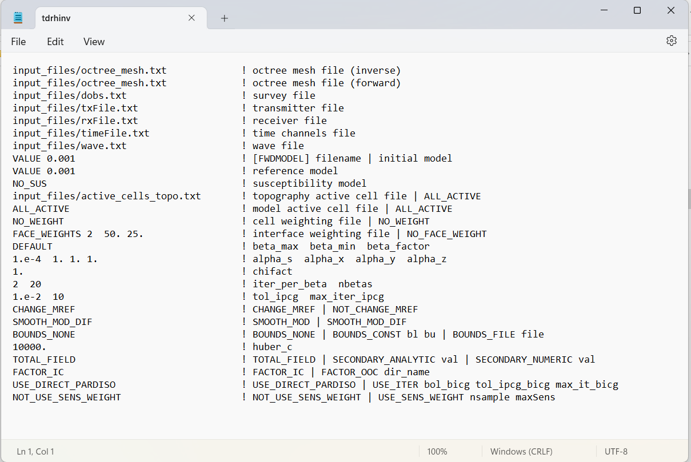

.. _tdrh_input_inv:

Inversion Input File
====================

The inverse problem is solved using the executable program **tdrh_v2.exe**. The lines of input file are as follows:

.. tabularcolumns:: |L|C|C|

+--------+-------------------------------------------------------------------------+-------------------------------------------------------------------+
| Line # | Description                                                             | Description                                                       |
+========+=========================================================================+===================================================================+
| 1      | :ref:`Inversion OcTree Mesh<tdrh_input_inv_ln1>`                        | path to inversion  octree mesh file                               |
+--------+-------------------------------------------------------------------------+-------------------------------------------------------------------+
| 2      | :ref:`Forward OcTree Mesh<tdrh_input_inv_ln2>`                          | path to forward octree mesh file                                  |
+--------+-------------------------------------------------------------------------+-------------------------------------------------------------------+
| 3      | :ref:`Observation File<tdrh_input_inv_ln3>`                             | path to observations/survey file                                  |
+--------+-------------------------------------------------------------------------+-------------------------------------------------------------------+
| 4      | :ref:`Transmitters file<tdrh_input_inv_ln4>`                            | path to file defining transmitters                                |
+--------+-------------------------------------------------------------------------+-------------------------------------------------------------------+
| 5      | :ref:`Receivers file<tdrh_input_inv_ln5>`                               | path to file defining receivers                                   |
+--------+-------------------------------------------------------------------------+-------------------------------------------------------------------+
| 6      | :ref:`Time channels file<tdrh_input_inv_ln6>`                           | path to file defining time channels                               |
+--------+-------------------------------------------------------------------------+-------------------------------------------------------------------+
| 7      | :ref:`Wave file<tdrh_input_inv_ln7>`                                    | sets time stepping and waveform for the time-dependent problem    |
+--------+-------------------------------------------------------------------------+-------------------------------------------------------------------+
| 8      | :ref:`Initial/FWD Model<tdrh_input_inv_ln8>`                            | initial/forward model                                             |
+--------+-------------------------------------------------------------------------+-------------------------------------------------------------------+
| 9      | :ref:`Reference Model<tdrh_input_inv_ln9>`                              | reference model                                                   |
+--------+-------------------------------------------------------------------------+-------------------------------------------------------------------+
| 10     | :ref:`Susceptibility model<tdrh_input_inv_ln10>`                        | susceptibility model                                              |
+--------+-------------------------------------------------------------------------+-------------------------------------------------------------------+
| 11     | :ref:`Active Topography Cells<tdrh_input_inv_ln11>`                     | topography                                                        |
+--------+-------------------------------------------------------------------------+-------------------------------------------------------------------+
| 12     | :ref:`Active Model Cells<tdrh_input_inv_ln12>`                          | active model cells                                                |
+--------+-------------------------------------------------------------------------+-------------------------------------------------------------------+
| 13     | :ref:`Cell Weights<tdrh_input_inv_ln13>`                                | additional cell weights                                           |
+--------+-------------------------------------------------------------------------+-------------------------------------------------------------------+
| 14     | :ref:`Face Weights<tdrh_input_inv_ln14>`                                | additional face weights                                           |
+--------+-------------------------------------------------------------------------+-------------------------------------------------------------------+
| 15     | :ref:`beta_max beta_min beta_factor<tdrh_input_inv_ln15>`               | cooling schedule for beta parameter                               |
+--------+-------------------------------------------------------------------------+-------------------------------------------------------------------+
| 16     | :ref:`alpha_s alpha_x alpha_y alpha_z<tdrh_input_inv_ln16>`             | weighting constants for smallness and smoothness constraints      |
+--------+-------------------------------------------------------------------------+-------------------------------------------------------------------+
| 17     | :ref:`Chi Factor<tdrh_input_inv_ln17>`                                  | stopping criteria for inversion                                   |
+--------+-------------------------------------------------------------------------+-------------------------------------------------------------------+
| 18     | :ref:`iter_per_beta nbetas<tdrh_input_inv_ln18>`                        | set the number of Gauss-Newton iteration for each beta value      |
+--------+-------------------------------------------------------------------------+-------------------------------------------------------------------+
| 19     | :ref:`tol_ipcg max_iter_ipcg<tdrh_input_inv_ln19>`                      | set the tolerance and number of iterations for Gauss-Newton solve |
+--------+-------------------------------------------------------------------------+-------------------------------------------------------------------+
| 20     | :ref:`Reference Model Update<tdrh_input_inv_ln20>`                      | reference model                                                   |
+--------+-------------------------------------------------------------------------+-------------------------------------------------------------------+
| 21     | :ref:`Hard Constraints<tdrh_input_inv_ln21>`                            | use *SMOOTH_MOD* or *SMOOTH_MOD_DIFF*                             |
+--------+-------------------------------------------------------------------------+-------------------------------------------------------------------+
| 22     | :ref:`Bounds<tdrh_input_inv_ln22>`                                      | upper and lower bounds for recovered model                        |
+--------+-------------------------------------------------------------------------+-------------------------------------------------------------------+
| 23     | :ref:`huber_c<tdrh_input_inv_ln23>`                                     | Huber constant (for sparse model recovery)                        |
+--------+-------------------------------------------------------------------------+-------------------------------------------------------------------+
| 24     | :ref:`Field Options<tdrh_input_inv_ln24>`                               | model total or secondary field                                    |
+--------+-------------------------------------------------------------------------+-------------------------------------------------------------------+
| 25     | :ref:`Memory Options<tdrh_input_inv_ln25>`                              | options for storing factorizations of forward system (RAM vs disk)|
+--------+-------------------------------------------------------------------------+-------------------------------------------------------------------+
| 26     | :ref:`Solver Options<tdrh_input_inv_ln26>`                              | iterative or direct solver options                                |
+--------+-------------------------------------------------------------------------+-------------------------------------------------------------------+
| 27     | :ref:`Sensitivity Weighting Options<tdrh_input_inv_ln27>`               | sensitivity weighting options                                     |
+--------+-------------------------------------------------------------------------+-------------------------------------------------------------------+

     Example input file for the inversion program (`Download <https://github.com/ubcgif/tdrh/raw/tdrh_v2/assets/input_files/tdrhinv.inp>`__ ). Example input file for forward modeling only (`Download <https://github.com/ubcgif/tdrh/raw/tdrh_v2/assets/input_files/tdrhfwd.inp>`__ ).

Line Descriptions
^^^^^^^^^^^^^^^^^

.. _tdrh_input_inv_ln1:

    - **Inversion OcTree Mesh:** file path to the OcTree mesh associated with the recovered model. All reference models, starting models and bounds should be defined on this mesh.

.. _tdrh_input_inv_ln2:

    - **Forward OcTree Mesh:** file path to the OcTree mesh on which the forward problem is solved. Generally, this is defined to be the same as the *inversion OcTree mesh*. In the case that it is different, the current model will be interpolated from the *inversion OcTree mesh* to the *forward OcTree mesh* in order to solve the forward problem.

.. _tdrh_input_inv_ln3:

    - **Observation File:** file path to the :ref:`observed data file<obsFile>` or a :ref:`survey index file<indexFile>` (forward modeling only).

.. _tdrh_input_inv_ln4:

    - **Transmitters File:** file path to the :ref:`transmitters file<receiverFile>`

.. _tdrh_input_inv_ln5:

    - **Receivers File:** file path to the :ref:`receivers file<receiverFile>`

.. _tdrh_input_inv_ln6:

    - **Time Channels File:** file path to the :ref:`time channels file<timeFile>`

.. _tdrh_input_inv_ln7:
    
    - **Wave file:** Set the path to a :ref:`wave file<waveFile>`. This file defines the time-steps for the problem.

.. _tdrh_input_inv_ln8:

    - **Initial/FWD Model:** On this line we specify either the starting model for the inversion or the conductivity model for the forward modeling. On this line, there are 3 possible options:

        - If the program is being used to forward model data, the flag 'FWDMODEL' is entered followed by the path to the conductivity model.
        - If the program is being used to invert data, only the path to a conductivity model is required; e.g. inversion is assumed unless otherwise specified.
        - If a homogeneous conductivity value is being used as the starting model for an inversion, the user can enter "VALUE" followed by a space and a numerical value; example "VALUE 0.01".

.. important::

    If data are only being forward modeled, only the :ref:`active topography cells<tdrh_input_inv_ln10>` and :ref:`tol_bicg tol_ipcg_bicg max_it_bicg<tdrh_input_inv_ln24>` fields are relevant. **However**, the remaining fields must **not** be empty and must have correct syntax for the code to run.

.. _tdrh_input_inv_ln9:

    - **Reference Model:** The user may supply the file path to a reference conductivity model. If a homogeneous conductivity value is being used for all active cells, the user can enter "VALUE" followed by a space and a numerical value; example "VALUE 0.01".

.. _tdrh_input_inv_ln10:

    - **Susceptibility Model:** The user may supply the file path to a background susceptibility model. Or the user may enter the flag *NO_SUS* if the background susceptibility is zero.

.. _tdrh_input_inv_ln11:

    - **Active Topography Cells:** Here, the user can choose to specify the cells which lie below the surface topography. To do this, the user may supply the file path to an active cells model file or type "ALL_ACTIVE". The active cells model has values 1 for cells lying below the surface topography and values 0 for cells lying above.

.. _tdrh_input_inv_ln12:

    - **Active Model Cells:** Here, the user can choose to specify the model cells which are active during the inversion. To do this, the user may supply the file path to an active cells model file or type "ALL_ACTIVE". The active cells model has values 1 for cells lying below the surface topography and values 0 for cells lying above. Values for inactive cells are provided by the background conductivity model.

.. _tdrh_input_inv_ln13:

    - **Cell Weights:** Here, the user specifies whether cell weights are supplied. If so, the user provides the file path to a :ref:`cell weights file <weightsFile>`  If no additional cell weights are supplied, the user enters "NO_WEIGHT".

.. _tdrh_input_inv_ln14:

    - **Face Weights:** Here, the user specifies whether face weights are supplied. If so, the user provides the file path to a face weights file :ref:`cell weights file <weightsFile>`. If no additional cell weights are supplied, the user enters "NO_FACE_WEIGHT". The user may also enter "EKBLOM" for 1-norm approximation to recover sharper edges.

.. _tdrh_input_inv_ln15:

    - **beta_max beta_min beta_factor:** Here, the user specifies protocols for the trade-off parameter (beta). *beta_max* is the initial value of beta, *beta_min* is the minimum allowable beta the program can use before quitting and *beta_factor* defines the factor by which beta is decreased at each iteration; example "1E4 10 0.2". The user may also enter "DEFAULT" if they wish to have beta calculated automatically.

.. _tdrh_input_inv_ln16:

    - **alpha_s alpha_x alpha_y alpha_z:** `Alpha parameters <http://giftoolscookbook.readthedocs.io/en/latest/content/fundamentals/Alphas.html>`__ . Here, the user specifies the relative weighting between the smallness and smoothness component penalties on the recovered models.

.. _tdrh_input_inv_ln17:

    - **Chi Factor:** The chi factor defines the target misfit for the inversion. A chi factor of 1 means the target misfit is equal to the total number of data observations.

.. _tdrh_input_inv_ln18:

    - **iter_per_beta nBetas:** Here, *iter_per_beta* is the number of Gauss-Newton iterations per beta value. *nBetas* is the number of times the inverse problem is solved for smaller and smaller trade-off parameters until it quits. See theory section for :ref:`cooling schedule <theory_cooling>` and :ref:`Gauss-Newton update <theory_GN>`.

.. _tdrh_input_inv_ln19:

    - **tol_ipcg max_iter_ipcg:** Here, the user specifies solver parameters. *tol_ipcg* defines how well the iterative solver does when solving for :math:`\delta m` and *max_iter_ipcg* is the maximum iterations of incomplete-preconditioned-conjugate gradient. See theory on :ref:`Gauss-Newton solve <theory_IPCG>`

.. _tdrh_input_inv_ln20:

    - **Reference Model Update:** Here, the user specifies whether the reference model is updated at each inversion step result. If so, enter "CHANGE_MREF". If not, enter "NOT_CHANGE_MREF".

.. _tdrh_input_inv_ln21:

    - **Hard Constraints:** SMOOTH_MOD runs the inversion without implementing a reference model (essential :math:`m_{ref}=0`). "SMOOTH_MOD_DIF" constrains the inversion in the smallness and smoothness terms using a reference model.

.. _tdrh_input_inv_ln22:

    - **Bounds:** Bound constraints on the recovered model. Choose "BOUNDS_CONST" and enter the values of the minimum and maximum model conductivity; example "BOUNDS_CONST 1E-6 0.1". Enter "BOUNDS_NONE" if the inversion is unbounded, or if there is no a-prior information about the subsurface model.

.. _tdrh_input_inv_ln23:

    - **Huber constant:** Here, the user may control the sparseness of the recovered model by specifying the Huber constant (:math:`\epsilon`) within the Huber norm. The tdrh code uses the Huber norm to define the smallness term (link) in the inversion. If a large value is used (*default = 10000*), the inversion will use an L2 norm for the smallness. If a sufficiently small value is used, the smallness will be similar to an L1 norm. The Huber norm is given by:

.. math::
    \sum_{i=1}^M x_i^2 \;\;\;\; \textrm{where} \;\;\;\; x_i = \begin{cases} \sigma_i^2 \;\; \textrm{for} \;\; \sigma_i \leq \epsilon \\ \epsilon \big ( 2 |\sigma_i | - \epsilon \big ) \;\; \textrm{for} \;\; \sigma_i > \epsilon    \end{cases}

.. _tdrh_input_inv_ln24:

    - **Field Options:** The user can model the total field or the secondary field. In the latter case, the user may choose whether the primary field is computed analytically or numerically for a homogeneous background conductivity.

        - Use the flag TOTAL_FIELD to model the total field.

        - Use the flag SECONDARY_ANALYTIC followed by a value for the background conductivity to model the secondary field. In this case, the code will compute the total field for the conductivity model provided, then subtract the analytic total field using the homogeneous background conductivity provided. To subtract the free-space primary field, let the background conductivity be 1e-8 S/m.

        - Use the flag SECONDARY_NUMERIC followed by a value for the background conductivity to model the secondary field. In this case, the code will compute the total field for the conductivity model provided, then subtract the numerically computed total field using the homogeneous background conductivity provided. To subtract the free-space primary field, let the background conductivity be 1e-8 S/m.

.. _tdrh_input_inv_ln25:

    - **Memory Options:** This code uses a factorization to solve the forward system at each frequency. These factorizations must be stored. By using the flag ‘FACTOR_IC’ (in cpu), factorizations are stored within a computer’s RAM. Although this is faster, larger problems cannot be solved if insufficient temporary memory is available. The factorizations are stored in permanent memory (disk) if the flag ‘FACTOR_OOC’ (out of cpu) is used followed by the path to a directory. This is slower because the program must read these files many times. The second options is ill-advised if files are being transferred over a network.

.. _tdrh_input_inv_ln26:

    - **Solver options:** Here the user chooses whether the forward problem is solved using a direct or iterative solver.

        - For Pardiso solver, the flag ‘USE_DIRECT_PARDISO’ is used.

        - For the BICG iterative solver, the flag ‘USE_ITER’ is used followed by values for the parameters *tol_bicg*, *tol_ipcg_bicg* and *max_it_bicg*.

            - *tol_bicg*: relative tolerance (stopping criteria) when solver is used during forward modeling. Ideally, this number is very small (default = 1e-10).
            - *tol_ipcg_bicg*: relative tolerance (stopping criteria) when solver needed in computation of δm during Gauss Newton iteration. This value does not need to be as large as the previous parameter (default = 1e-5).
            - *max_it_bicg*: maximum number of BICG iterations (default = 100)

.. _tdrh_input_inv_ln27:

    - **Sensitivity weighting options:**

        - For no sensitivity weighting, use the flag *NOT_USE_SENS_WEIGHT*
        - To apply sensitivity weighting, use the flag *USE_SENS_WEIGHT* followed by values for the parameters *nsample* and *maxSens*. If applied, sensitivity weights are constructed using the starting model and the weights used in the inversion are output to the file *sensitivity.txt*. The parameters *nsample* and *maxSens* are defined as follows:

            - *nsample* is the number of iterations used to approximate the root mean squares sensitivities with the probing method; see :ref:`sensitivity weights <theory_sens_weights>`. *nsample* corresponds to the value of the variable :math:`K` in the mathematical description. Generally *nsample* is an integer value between 5 and 10. 
            - *maxSens* is the maximum value for the sensitivity weights; see :ref:`sensitivity weights<theory_sens_weights>`. *maxSens* corresponds to the variable :math:`\tau` in the mathematical description. Generally this is a number between 10 and 1000.

