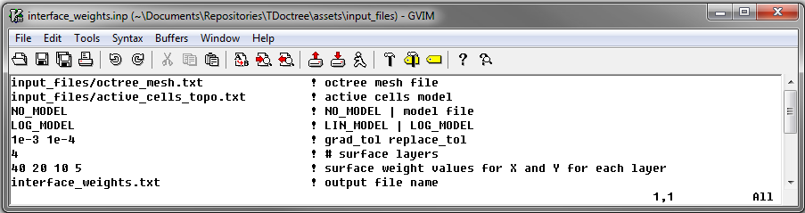

.. _tdoctree_input_weights:

Interface Weights
=================

The parameters used to create interface weights are defined in the input file. The lines within the input file are as follows:

.. tabularcolumns:: |L|C|C|

+--------+--------------------------------------------------------------+--------------------------------------------------------------------------------------+
| Line # | Parameter                                                    | Description                                                                          |
+========+==============================================================+======================================================================================+
| 1      | :ref:`OcTree Mesh<tdoctree_face_weight_ln1>`                 | path to octree mesh                                                                  |
+--------+--------------------------------------------------------------+--------------------------------------------------------------------------------------+
| 2      | :ref:`Active Cells<tdoctree_face_weight_ln2>`                | path to active cells model                                                           |
+--------+--------------------------------------------------------------+--------------------------------------------------------------------------------------+
| 3      | :ref:`Model<tdoctree_face_weight_ln3>`                       | path to a reference conductivity model                                               |
+--------+--------------------------------------------------------------+--------------------------------------------------------------------------------------+
| 4      | :ref:`Mapping Type<tdoctree_face_weight_ln4>`                | set as log or linear mapping                                                         |
+--------+--------------------------------------------------------------+--------------------------------------------------------------------------------------+
| 5      | :ref:`Gradient Tolerance<tdoctree_face_weight_ln5>`          | set threshold for largest gradients preserved in recovered model                     |
+--------+--------------------------------------------------------------+--------------------------------------------------------------------------------------+
| 6      | :ref:`# Surface Layers<tdoctree_face_weight_ln6>`            | set number of cells below surface in which weighting horizontal smoothing is applied |
+--------+--------------------------------------------------------------+--------------------------------------------------------------------------------------+
| 7      | :ref:`Horizontal Surface Weights<tdoctree_face_weight_ln7>`  | sets the weighting for horizontal smoothing for each layer                           |
+--------+--------------------------------------------------------------+--------------------------------------------------------------------------------------+
| 8      | :ref:`Output Name<tdoctree_face_weight_ln8>`                 | name for output face weighting file                                                  |
+--------+--------------------------------------------------------------+--------------------------------------------------------------------------------------+

     Example input file for creating interface weights (`Download <https://github.com/ubcgif/tdoctree/raw/tdoctree/assets/input_files/interface_weights.inp>`__ )

.. _tdoctree_input_face_weights_lines:

Line Descriptions
^^^^^^^^^^^^^^^^^

.. _tdoctree_face_weight_ln1:

    - **OcTree Mesh:** file path to the OcTree mesh file

.. _tdoctree_face_weight_ln2:

    - **Active Topography Cells:** Here, the user can choose to specify the cells which lie below the surface topography. To do this, the user may supply the file path to an active cells model file or type "ALL_ACTIVE". The active cells model has values 1 for cells lying below the surface topography and values 0 for cells lying above.

.. _tdoctree_face_weight_ln3:

    - **Conductivity Model:** Here, the user provides reference model containing the conductivity structures they would like to preserve. The flag "NO_MODEL" may be used if only surface weighting is applied.

.. _tdoctree_face_weight_ln4:

    - **Mapping Type:** Here, the user specifies whether the mapping between the model value and the physical property value on the mesh is linear or logarithmic. To specify, use the flags "LIN_MODEL" or "LOG_MODEL". In the case of tdoctree, the inversion recovers the log-conductivity. As a result, the user should use "LOG_MODEL".

.. _tdoctree_face_weight_ln5:

    - **Gradient Tolerance:** Here, the user specifies the threshold for the largest gradients that can be preserved followed by a replacement value if the gradient is over the threshold (i.e. *Val1* *Val2*). If we try to preserve very large gradients due to blocky models, we may fit these features at the expense of others. The tolerance threshold and replacement value should be determined from the expected physical property values and cell size. *For log-conductivity and 100m cell widths, a good threshold might be:* :math:`\sigma_{max}/dh`.

.. _tdoctree_face_weight_ln6:

    - **# Surface Layers:** This represents the first parameter used to apply surface weighting. Here, the user specifies how many cell layers below the surface will have surface weighting in X and Y.

.. _tdoctree_face_weight_ln7:

    - **Horizontal Surface Weights:** Here, the user specifies the weights on X and Y faces for every layer (from surface layer downwards). Essentially, we are invoking a smoothness along the X and Y directions that decreases with depth. The user must enter a set of decreasing values separated by spaces. The number of values that must be entered is equal to the integer value set on the previous line.

.. _tdoctree_face_weight_ln8:

    - **Output Name:** File name for the output interface weights file.
