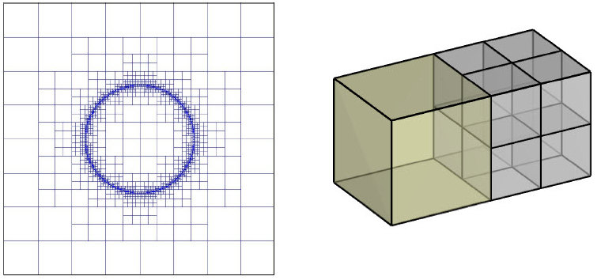

.. _overview:

Package overview
================

.. important:: TDoctree version 2 performs forward modeling and inversion with the executable **tdoctree_v2.exe**. Past iterations of this code may have been given the name 'tdinvInt16.exe'. To use this code, ensure you have downloaded 'tdoctree_v2.exe' and all related files from the UBC-GIF website.

Description
-----------

This manual provides instruction and background for the **TDoctree version 2** program library for the forward
modelling and inversion of time domain electromagnetic survey data. In order to decrease
computational time and increase accuracy by mesh refinement in areas of interest, conductivity models
are discretized on an Octree mesh.  

     2D (QuadTree) mesh discretization about a ring (left). Cell refinement for OcTree mesh (right).

For ease of use the program library includes several utilities which generate OcTree meshes and additional weights. From the users point of view the software
operates in much the same way as previous GIF codes. This version is currently run through the
command line only.

The program library provides codes to do the following:

    - Construct models on OcTree meshes.
    - Forward model time domain magnetic field responses to a 3D volume of contrasting conductivity, on and octree mesh.
    - Invert of surface, borehole and/or airborne EM data to recover 3D conductivity models:

The equations are discretized in time using backward Euler method and discretized in space by using a finite volume technique on a staggered grid. The sources can be grounded dipoles or loop currents that reside in the air, on the surface, or inside the earth. The responses can be any combination of components of E, H, or dB/dt. The transmitter waveform is user-defined and there are no restrictions on the length or shape of the waveform. Data can be simulated in the “on-time” or “off-time”. The earth model is an arbitrary 3D conductivity defined on a structured rectangular mesh. The earth can also have an arbitrary 3D magnetic susceptibility.
The solutions are achieved by factorizing the forward modelling matrix and hence it is possible to simulate data from many sources. This is one of the major benefits of this approach.

The inversion is solved as an optimization problem with the simultaneous goals of (i)
minimizing an objective function dependent on the model and (ii) generating synthetic
data that match observations to within a degree of misfit consistent with the statistics
of those data. To counteract the inherent lack of information, the formulation incorporates reference
model and regularization.

Capacity for the user to directionally weight smoothing and reference model influence
as well as overall influence of regularization on objective function minimization. Explicit
prior information may also take the form of upper and lower bounds on the conductivity
contrast in any cell.

The regularization parameter (controlling relative importance of objective function and
misfit terms). The initial research underlying this program library was funded principally by the mineral industry
consortium “Joint and Cooperative Inversion of Geophysical and Geological Data” (1991 -
1997) which was sponsored by NSERC and the following 11 companies: BHP Minerals, CRA Exploration,
Cominco Exploration, Falconbridge, Hudson Bay Exploration and Development, INCO
Exploration & Technical Services, Kennecott Exploration Company, Newmont Gold Company,
Noranda Exploration, Placer Dome, and WMC.

Program Library Content
-----------------------

The main executable programs within the TDoctree version 2 program library are:

    - **create_octree_mesh_td_v2:** creates an OcTree mesh based on the survey geometry
    - **tdoctree_v2:** used to forward model and inverted TEM data

Also included are the following Octree utility programs:

      - **blk3cellOct:** creates block models directly on OcTree meshes
      - **interface_weights:** generates interface weights

Licensing
---------

Licensing for commercial use is managed by distributors, not by the UBC-GIF research group.
Details are in the `Licensing policy document <http://gif.eos.ubc.ca/software/licensing>`__.

Installing TDoctree
-------------------

TDoctree Executables
^^^^^^^^^^^^^^^^^^^^

There is no automatic installer currently available for TDoctree version 2. Please follow the following steps in
order to use the software:

    1. Extract all files provided from the given zip-based archive and place them all together in a new folder.
    2. Add this directory as new path to your environment variables.
    3. Make sure to create a separate directory for each new inversion, where all the associated files will be stored. Do not store anything in the bin directory other than executable applications and Graphical User Interface applications (GUIs).

.. MPI Executables
.. ^^^^^^^^^^^^^^^

.. Message passaging interface (MPI) programming allows TDoctree version 2 to utilize parallel computing. Even if the code is being run on a single machine, the user is **required** to download the necessary MPI package to use the TDoctree version 2 executables. To set up MPI:

..     1. Download and install:
      
..       - `Microsoft MPI v10.0 <https://www.microsoft.com/en-us/download/details.aspx?id=57467>`__ : Required for window machines
..       - `MPICH <https://www.mpich.org/downloads/>`__ : Required for Linux machines
..       - `Open MPI v4 <https://www.open-mpi.org/software/ompi/v4.0/>`__ : Optional programming to set MPI threads

..     2. Path the folders containing MPI executables to your environment variables.

