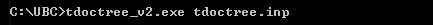

.. _tdoctree_inv:

Inversion Program
=================

Both the forward and inverse problems are solved using the **tdoctree_v2.exe** executable program. In each case, format of the :ref:`input file<tdoctree_input_inv>` (denoted here as **tdoctree.inp**) is the same. In the case of forward modeling however, some lines in the input file are omitted.

Running the Program
^^^^^^^^^^^^^^^^^^^

Unlike some other UBC-GIF programs, the *mpiexec* call **cannot** be used to parallelize multiple processes (large-scale independent operations) within the code. To run the executable, open a command window and type the following:

Setting Number of Threads with Open MPI
^^^^^^^^^^^^^^^^^^^^^^^^^^^^^^^^^^^^^^^

Before running the executable, the number of threads used to carry out all simultaneous processes can be set with Open MPI. This is set in the command window **before** running the executable. To set the number of threads (*nThreads* ), use the following syntax:

    - Windows computer: "set OMP_NUM_THREADS=nThreads"
    - Linux (bash shell): "export OMP_NUM_THREADS=nThreads"
    - Linux (csh shell): "setenv OMP_NUM_THREADS nThreads"

.. important:: The number of processes (*nFreq* ) times the number of threads (*nThreads* ) **cannot** exceed the total number of threads available from the computer.

Units
^^^^^

    - **Electric field data:** *Ex*, *Ey* and *Ez* in units V/m
    - **Magnetic field data:** *Hx*, *Hy* and *Hz* in units A/m. 
    - **Magnetic field data:** *dBx/dt*, *dBy/dt* and *-dBz/dt* in units T/s. The vertical component of dB/dt is represented using -dBz/dt due to a long-standing plotting convention 
    - **Conductivity model:** S/m
    - **Susceptibility model:** SI
    - **Reference/starting conductivity model:** S/m 
    - **Model/interface weights:** unitless

.. important:: Any combination of data, electric and or magnetic field components, can be be inverted. A specified flag at the start of the observations file can be used to omit columns or individual datums.

Output Files
^^^^^^^^^^^^

The program **TDoctreeinv.exe** creates the following output files:

    - **dpred0.txt** data predicted using the starting model or forward model

    - **inv_xxx.con:** recovered model at iteration 'xxx'

    - **dpred_xxx.txt** data predicted using model 'xxx'

    - **inv.con:** final conductivity model

    - **tdoctree_v2.log:** log file for the inversion

    - **tdoctree_v2.out:** stores details regarding the inversion

